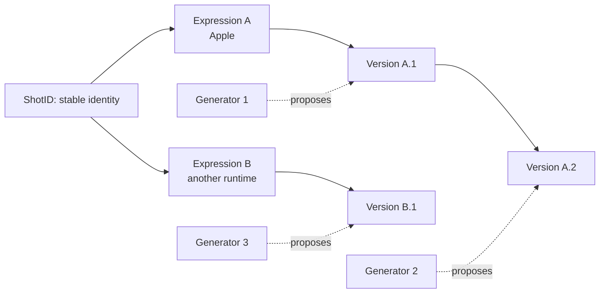
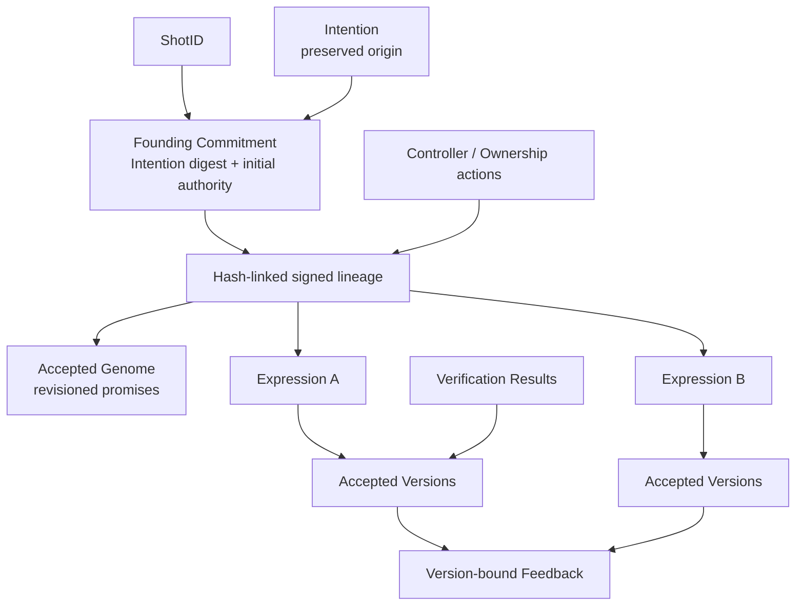
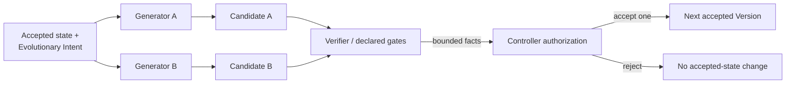
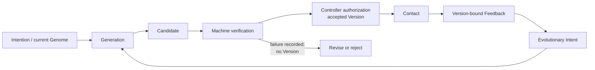
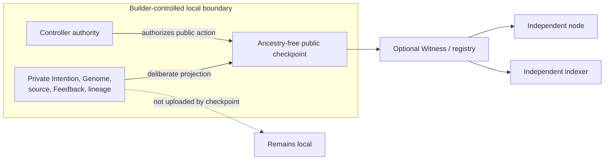

# TOHSENO: A Protocol for Software Continuity

## Persistent identity across changing implementations

**Author:** JP Franetovic  
**Affiliation:** Anky, Inc.  
**Date:** August 2026  
**Status:** Composite pre-1.0 protocol candidate; working paper

## Abstract

Software is usually identified by something that gives it a present form: a repository, package, binary, bundle identifier, account, deployment, model session, vendor, or running service. Those identifiers can name locations, providers, or exact artifacts. They do not by themselves define one continuing software object across materially different implementations.

TOHSENO proposes such an object: the **Shot**. A Shot has a random stable identifier and a controller-authorized history that binds a commitment to the founding **Intention** record, an explicitly accepted and revisioned **Genome**, declared runtime **Expressions**, immutable accepted **Versions**, and evidence about both machine verification and use. Continuity is not inferred from code similarity. It is an explicit protocol claim: the current controller authorizes a proposed state under declared constraints, and deterministic reduction makes the claim and its ancestry mechanically checkable. Cryptography establishes commitments, signatures, and ordering; it does not establish usefulness, semantic wisdom, or legal title.

A Shot can exist and be verified locally without publication. An optional public Witness may record a deliberately narrow projection without creating the Shot or acquiring control. Git, content-addressed storage, reproducible builds, and supply-chain attestations can serve as substrates and evidence; TOHSENO does not replace them. Its proposed contribution is the software-specific continuity state machine that composes them.

The first factory is Apple-oriented, but neither Apple nor its Generator is privileged by the protocol. If the Builder retains the necessary keys, records, source, assets, data, and build knowledge, another Generator can continue the Shot. The first Generator can disappear. The Shot remains.

## 1. Introduction: software without continuity

Software has acquired excellent identifiers for many things around it. Git names exact content and connects commits into histories. Package managers name releases. OCI descriptors address packaged artifacts. App stores bind listings to vendor accounts and bundle identifiers. Build systems describe derivations. Supply-chain attestations state how an artifact was produced. A running service can be named by an origin, account, or endpoint.

Each answer is useful, but each answers a narrower question than this one:

> What makes a materially changed implementation a later state of the same software object?

Ordinary practice answers socially. A maintainer says that a rewrite is version 2. A company moves a product between repositories. A mobile application is rebuilt for another platform. A hosted service changes every internal component while keeping its name and account. These continuities may be sensible, but the underlying systems usually identify the artifacts, locations, and authorities involved rather than encoding the continuity claim itself.

Generative systems make the gap easier to see. They can produce many plausible implementations from the same request, replace a source tree, or reconstruct an interface in another language. Artificial intelligence did not create the continuity problem; rewrites, ports, forks, maintainer transfers, and disappearing vendors long predate it. Generation makes implementation cheaper and more replaceable, so the absence of a durable object around which implementations change becomes more consequential. A prompt or agent session cannot carry that burden. It is provider-specific, often incomplete, and neither an accepted state nor an authority record.

TOHSENO tests a narrow hypothesis:

> A Shot is a continuing software object whose identity is independent of any particular implementation.

The claim is not that software possesses an essence, or that a protocol can discover metaphysical sameness. The claim is operational. A Shot is constituted by a stable identity and a typed, signed, reducible history with domain-specific rules for origin, accepted constraints, implementations, evidence, and authority. Independent conforming software can decide whether a sequence of records is a valid continuation of that object. It cannot decide whether the continuation was a good idea.

This separation is the center of the proposal. A radical rewrite may be admitted under the same Shot if the authorized controller accepts it through the required transitions. The controller may instead create a distinct Shot and declare a parent relationship. The protocol exposes which choice was made, who had authority to make it, which commitments changed, and what evidence was recorded or referenced. It does not turn judgment into a hash.

The result is neither a replacement for version control nor a universal identity layer. It is a candidate protocol object for software continuity.

## 2. Continuity through change

The Ship of Theseus, a changing organism, and a seed becoming a tree all supply the same useful intuition: material persistence and identity persistence are different questions. None supplies a protocol rule. A seed does not contain a pixel-perfect mature tree; a person is not identified by a checksum of one bodily state; a ship's name does not settle every dispute about replacement. These analogies reveal the problem and then stop.

TOHSENO replaces metaphor with explicit distinctions:

- The **Shot** is the continuing protocol object.
- The **Intention** records committed founding-material descriptors; retained bytes can be checked against them.
- The **Genome** records the currently accepted operational promises and boundaries.
- An **Expression** is one concrete body in a particular environment.
- A **Version** records one accepted state of one Expression.
- An **Evolution** relates adjacent already accepted Versions through an earlier Evolutionary Intent.
- **Contact** is the encounter between an Expression and reality.
- **Evidence** records bounded machine findings or observations from Contact.
- A **Generator** proposes an implementation.
- A **Verifier** records bounded outcomes under a declared gate policy.
- The current controller authorizes what enters accepted history.
- An optional **Witness** preserves a narrow public projection; it does not create identity.

The biological vocabulary is therefore mnemonic, not ontological. The Genome is not the Shot, and software is not literally alive. Continuity results from a stable identifier, preserved records, accepted constraints, content commitments, explicit transition rules, controller authorization, and visible lineage.

Figure 1 shows the core distinction. The ShotID does not change when source, runtime, or Generator changes. A declared ExpressionID also remains stable; new Expressions and accepted Versions receive distinct identifiers.



*Figure 1 — The continuing Shot. One Shot may have changing accepted Versions and multiple Expressions. Generators produce candidates; they are not the identity.*

The stable identifier is useful only because the rest of the state machine gives references to it consequences. A random label with no verifiable genesis, transition law, or retained material would be ceremonial. TOHSENO's newness claim must therefore rest on the complete object, not on the label alone.

## 3. The proposed primitive

### 3.1 Definition

Within this candidate, a **Shot** is minimally a random stable ShotID, a signed founding Commitment, and the authorized reducible prefix that begins with it. It may accumulate the following typed state:

1. the founding commitment to an exact Intention record and initial authority;
2. an accepted Genome and its explicit revision history;
3. declared Expressions and immutable accepted Versions;
4. evidence and evolutionary decisions bound to exact Versions; and
5. later controller state, availability observations, associations, and parent relations.

This definition identifies an event-sourced aggregate specialized for software. The current state is not stored as an unexamined mutable row. It is derived from a valid prefix of signed actions. Domain rules determine which actions may follow: an initial Genome must be proposed and accepted; an Expression must bind an accepted Genome; a Version requires a matching successful VerificationResult; feedback must name an accepted Version; an Ownership action must be authorized by the current controller; and so on.

The Shot is not identical to its name, alias, folder, repository, prompt, source tree, current body, binary, app-store listing, token, controller, Generator, public checkpoint, or any Version. These may cease to be current, be lost, duplicated, or be succeeded without changing the ShotID. Accepted records cannot be changed in place within a valid retained lineage. Whether the Shot remains *materially continuable* is a separate question considered in Section 10.

### 3.2 What the ShotID proves

A native ShotID is a cryptographically random, nonzero 32-byte value created once. It is deliberately not derived from an Intention, source digest, BuilderID, token address, bundle identifier, name, or repository. Deriving it from mutable content would make continuity impossible; deriving it from a controller would make transfer change identity.

The ShotID alone proves almost nothing. It is a high-entropy namespace value with negligible accidental-collision probability, not evidence of authorship, content, public registration, legal ownership, or quality. Its significance arises when a verifier is given a valid founding action and enough authorized lineage to reduce the Shot's state. A reference to a bare ShotID should therefore be read as a claim awaiting context.

For exact content, the protocol uses content commitments. For continuity, it uses the stable ShotID. Conflating those functions would either make changing software impossible or make exact-state verification vague.

### 3.3 A minimal transition model

The normative encodings are in the [protocol specification](protocol/SPECIFICATION.md), schemas, and conformance vectors. The following notation is explanatory.

Let a lineage action be:

```text
a_i = (schema, sequence i, previous h_(i-1), ShotID,
       actor, timestamp, availability, payload, H(payload))

h_i = SHA-256(RFC8785(a_i))
```

The action commitment `h_i` is also the digest signed once by its P-256 signature sidecar. Sequence one has no predecessor and carries a `Commitment` payload:

```text
Commitment(H(Intention), initial BuilderID,
           initial controller key, origin, time)
```

The full Intention record may be carried later, including privately, but its canonical digest must match the founding commitment. A deterministic reducer `R` accepts one complete prefix only if sequences and predecessor commitments are contiguous, timestamps do not move backward, the ShotID is constant, signatures are valid, each actor and signer matches the controller state derived by that prefix, and each payload-specific transition is legal. Pure reduction trusts the initial controller/key binding declared by the Commitment; it does not independently establish public BuilderAccount authority.

A VersionID is content-bound within a Shot and Expression:

```text
VersionID = SHA-256(
  "TOHSENO-VERSION-ID-V2\0" || ShotID || ExpressionID ||
  u64be(ordinal) || genome_digest || source_digest
)
```

The formula does not make two programs semantically equivalent. It unambiguously names the tuple of Shot, Expression, ordinal, accepted Genome digest, and source digest. The full signed Version action binds the remaining accepted-state facts.

The lineage is a single-predecessor chain for any reducible branch. The broader history can contain competing children of one head, so the observed structure is a tree of incompatible prefixes rather than a mergeable Git DAG. The reducer does not erase competing heads or choose a global winner. A deliberately created descendant or fork is a different ShotID with an explicit `ParentRelation`; this is distinct from a same-Shot lineage conflict.

### 3.4 What persists

Across a valid continuation, the following persist:

- the ShotID;
- the founding commitment and, when available, exact Intention record;
- the append-only authorized lineage up to the selected head;
- every prior accepted Genome revision and Version commitment;
- the controller state derived from the founding Commitment and later authorized Ownership actions;
- explicit relationships among Expressions, Versions, evidence, and Evolutions.

Names, interfaces, frameworks, languages, source layouts, Generators, models, devices, accounts, repositories, package coordinates, and distribution channels may change. A Genome may change only by proposal and acceptance. An Expression may receive later Versions; a newly declared Expression receives another ExpressionID. The protocol does not decide when a material change ought to become a new Expression rather than a new Version. An accepted Version never changes in place.

This is scoped continuity, not universal tracking. Installation identity is local to an application installation. Continuity statements have an explicit Shot audience and bounded claims. The protocol does not give every application a universal cross-service identity for a person.

## 4. Shot anatomy

Figure 2 shows the records that carry the object. Not every conceptual role is a distinct wire payload: Contact is an event in use; Lived Evidence is represented through version-bound Feedback; and Generator and Verifier are roles around proposal and testing. The canonical lineage payload types are defined by the neutral `/2` schema.



*Figure 2 — Shot anatomy. The Shot is the whole reducible object, not the Genome or any single body. Arrows show logical bindings rather than public disclosure.*

### 4.1 Intention

The **Intention** is the preserved human declaration from which the Shot began. In the neutral model it contains one to sixty-four original materials: words, images, references, examples, or other artifacts described by exact digests and availability. Inline text, when present, is bound to exact bytes and length. An optional note and capture time are part of the canonical record.

The Intention is historical evidence, not a perpetually edited product brief. Correcting its spelling after seeing the implementation would change its commitment and falsely rewrite origin. Later understanding belongs in Feedback, an Evolutionary Intention, or a Genome proposal. The full founding material may remain intentionally private while its digest remains bound at genesis.

Preservation does not establish that the Intention was original, lawful, wise, or written by the person named in prose. It establishes that the later Shot history refers to the same committed bytes.

### 4.2 Genome

The **Genome** is the accepted operational constitution of the Shot. It records a revision number and structured statements about purpose, intended users, essential experience, behavioral invariants, interaction laws, privacy and ownership principles, boundaries, non-goals, required capabilities, forbidden transformations, acceptance principles, platform commitments, and matters free to change.

It is more precise than “DNA.” The Genome is neither source code nor a complete architecture. It is not a Generator prompt, static configuration file, model memory, or test suite. Files, gates, and tests may represent and check portions of it, but they remain mechanisms serving the accepted law. Some provisions are mechanically testable; others require Builder judgment.

The distinction can be stated compactly:

> Intention preserves origin. Genome preserves promises.

A Genome becomes current only through two signed actions: a proposal and an explicit acceptance that references that proposal's action commitment. Revision one has no base. A later proposal must name the exact current revision and digest and summarize its mutations. A Version cannot smuggle in a Genome change by merely pointing at new prose.

The Genome does not make semantic conformance decidable. A malicious or careless controller can accept a weak Genome, revise away a defining promise, or approve an implementation that violates a nuanced requirement. The protocol makes those decisions attributable and reviewable; it cannot make them sound.

### 4.3 Expression

An **Expression** is one concrete body of the Shot in an environment. Its declaration has a random stable ExpressionID, a kind, a name, one or more platforms, the accepted Genome revision and digest it claims to embody, and a reference describing the availability of its definition artifact.

Two iOS implementations may be successive Versions of one Expression if the controller treats them as continuations of that body. A mobile application and a web or desktop application may instead be separate Expressions under one Shot. They share Shot identity and accepted law, not necessarily source, interface, storage format, or capabilities.

The protocol does not mechanically prove that multiple Expressions are “really” the same application. It proves that an authorized lineage declared them to be bodies of one Shot under specified Genome commitments. Reviewers can inspect the declaration and evidence; the controller bears the semantic judgment.

The neutral schema also includes **Organ** declarations: immutable, expression-scoped capability units whose dependency graph, state ownership, permissions, events, Genome constraints, and acceptance tests contribute to a Version's capability-graph digest. Organ is useful structured capability vocabulary. The current Apple Fascia gives it a concrete profile. It should not be mistaken for the Shot's timeless essence or assumed to map naturally to every future runtime.

### 4.4 Version

A **Version** is one immutable accepted state of one Expression. Its record binds:

- the ExpressionID and expression-local ordinal;
- the accepted Genome revision and digest;
- the source digest;
- materialization provenance;
- the exact capability-graph digest;
- a matching successful VerificationResult action;
- known incompleteness;
- acceptance time; and
- optional build identity and build digest.

“Immutable” here is a verification property, not a claim that storage media cannot be edited. Changing the canonical action changes its commitment, breaks successor links, or invalidates the signature. The old accepted state remains the state named by its VersionID. Later work creates another Version; it does not rewrite this one.

A working tree is not a Version. Neither is a model response, candidate source directory, Git commit, successful compilation, binary, deployment, or app-store release. Any may contribute evidence or a digest. A Version exists in accepted protocol history only after a successful matching VerificationResult and an authorized Version action.

Acceptance does not imply completeness or reproducibility. Known incompleteness is explicit, a build digest is optional, and material referenced by a digest may later be unavailable. Reproducing an artifact requires the stronger conditions of a reproducible build system and retention of all necessary inputs.

### 4.5 Evolution

A recorded **Evolution** is an authorized lineage relation between two distinct adjacent accepted Versions of the same Expression, grounded in an earlier Evolutionary Intent. It names the exact from- and to-VersionIDs and Genome digests, states preserved invariants, and—when the Genome changed—references the exact Genome acceptance.

Not every source edit, Git commit, build, model generation, deployment, or accepted Version is by itself an Evolution. The target Version must already be accepted; the reducer then checks adjacency and intent. Current law does not require every noninitial accepted Version to be followed by an Evolution. An accepted head can therefore advance without one. Evolution adds the explicit claim that an adjacent successor answers an earlier scoped intent; it is not the mechanism that accepts the target Version. This is an important limitation if a profile expects every accepted change to complete the full evolutionary loop.

At protocol level this yields four different cases:

1. **Working change:** files differ, but no accepted action exists. The Shot's accepted state has not moved.
2. **Accepted successor:** required records, verification, and Version authorization advance the accepted state of the same Expression.
3. **Completed Evolution:** a later action relates adjacent accepted Versions to an earlier Evolutionary Intent and any required Genome acceptance.
4. **New Shot:** a separate ShotID begins, optionally recording `fork`, `descendant`, or `inspired_by` relation to a parent head.

Copying a folder does not automatically create any of these claims. Possession of files is not controller authority.

### 4.6 Builder, controller, BuilderID, and DeviceKey

The **Builder** is the human or organization making creative and custodial decisions. The wire protocol cannot prove that a human personally considered each decision; it proves that an authorized key signed it. For this reason the paper uses **controller** for the mechanically evaluated authority state.

A **BuilderID** is the protocol identifier representing that authority. In the successor public design it has the form `eip155:4663:0x…` and denotes a BuilderAccount address on chain 4663. An address-shaped local or predicted identifier is not proof that the account exists or is publicly authoritative. Neutral lineage binds an initial BuilderID and P-256 controller public key; an Ownership action signed by the current controller installs the next BuilderID and controller key.

A **DeviceKey** is a P-256 key authorized within a BuilderAccount. The successor account design separates devices from administrators, allows delegation by permission, and provides delayed recovery that replaces the key set only after a three-day window in which an administrator can cancel. Recovery authority, device rotation, Builder control, and Apple code-signing identity are different concerns. Apple signing is external to TOHSENO's controller-key protocol.

The frozen v0.7 identity supports only its initial device key; rotation and recovery were never completed for that lineage. The successor on-chain design closes the contract semantics. This checkout's resolver treats its deployed contracts as active under a threshold-signed release authority, but authoritative protocol prose still declares the generation inactive; Section 16 records that unresolved contradiction. In either reading, the public witness workflows that would use it are not implemented, so accepted product state remains local.

### 4.7 Generator and Verifier

A **Generator** is any system that proposes implementation material or a transition: Codex, Claude Code, another coding harness, a human team, a specialized program synthesizer, or a deterministic toolchain. The first Generator has no permanent privilege.

A **Verifier** is intended to be a deterministic system that evaluates declared gates and records bounded results against a candidate. It may establish that canonical commitments match, signatures verify, source conforms to a profile rule, a permission is present or absent, specified tests pass, or a build succeeds. The VerificationResult binds the candidate VersionID, Genome, source, capability graph, gate conjunction, known incompleteness, and time. Current wire law allows a gate to declare itself nondeterministic and does not require every gate to be deterministic, so the record alone cannot establish that property.

A Verifier does not prove usefulness, beauty, absence of all defects, full semantic fidelity to natural language, or metaphysical sameness between Expressions. A gate also does not prove that the external test runner itself was trustworthy. Verifier policy and evidence remain reviewable assumptions.

The intended separation is:

> Generation produces a proposal. Verification establishes bounded machine facts. Authorization makes an accepted Version part of history.

The neutral wire schema requires a successful VerificationResult before a Version, but it does not cryptographically enforce organizational independence between Generator and Verifier. A single operator could run both, and the controller could authorize nonsense. Independence is therefore a system and profile requirement, not a fact implied by the record type alone.

## 5. Origin and law without revisionism

The Intention/Genome split solves a recurring provenance failure. If one document must serve both as the origin story and the current specification, evolution produces pressure to rewrite history. A later implementation discovers what the original words omitted; the document is “clarified”; the new system then appears to have satisfied an intention that did not exist at genesis.

TOHSENO instead treats origin and present law as separate timelines. The founding action commits to the Intention. The Intention action, whenever disclosed, must match that digest and may occur only once. The Genome begins at revision one and may change explicitly. Feedback can explain why. An Evolutionary Intent can select exact feedback actions and request implementation-, Expression-, Organ-, or Genome-scoped changes. A later Genome proposal names its exact base and mutation summary.

This does not make the founding words supreme. A vague, harmful, or obsolete Intention may deserve to be left behind. The controller can authorize a Genome that departs radically from it. What the protocol prevents is silent retroactive repair. A reviewer can see both what began the Shot and what it later promised.

That distinction also limits the founding record's power. Intention is evidence of origin, not a perpetual veto, source of legal rights, or oracle of meaning. Genome is current accepted law, not proof that reality conforms to it.

## 6. Bodies and accepted moments

Software continuity requires both stable identity and exact-state identity. A ShotID alone deliberately survives content changes; a VersionID deliberately does not. Expressions locate exact Versions within distinct bodies.

Suppose a field-notebook Shot first appears as a native iPhone app. Its Apple Expression has an ExpressionID and Version 1 binds the accepted Genome, source, capabilities, verification, and known limitations. A later rewrite in a different UI framework can be Version 2 of the same Expression if the authorized history treats it that way. A web implementation can be a second Expression with its own random ExpressionID and ordinal sequence. Both bodies can cite the same current Genome while having different source and platform commitments.

There is no requirement that all Expressions advance together. The iPhone body might be on Version 4 and the web body on Version 1. Feedback must name the exact ExpressionID and VersionID that produced it, so an observation about the web interface cannot silently become evidence about the mobile implementation.

The protocol's immutability is selective. Accepted moments and prior actions do not change. The current head, current Genome, controller, known availability, and collection of Expressions can change only by adding valid actions. This freezes history without freezing software.

An unavailable artifact demonstrates the limit of commitments. A digest can prove that rediscovered bytes are the committed bytes; it cannot reconstruct missing bytes. An `artifact_availability` action can later record an observation without rewriting the referenced record, but an availability label does not make material exist.

## 7. Generation, verification, and authorization

Agentic development often collapses three acts. A model writes code, runs tests that it selected, and reports completion. That report can be useful, but it combines proposal, measurement, and acceptance under one epistemic boundary.

TOHSENO separates them because their failure modes differ:

- A Generator can misunderstand the request, omit files, fabricate a success report, or optimize for a weak test.
- A Verifier can have incomplete gates, execute compromised tools, or correctly prove an irrelevant property.
- A controller can be careless, coerced, compromised, or simply choose badly.

The protocol does not eliminate any failure. It makes the roles and resulting claims distinct. A failed VerificationResult may remain in honest history, but it cannot authorize a Version. A passed result must match the candidate's source digest, Genome, capability graph, VersionID, and known incompleteness. The current controller then signs the Version action. The signature establishes key authorization, not conscious human review.

This design permits a Generator to be replaced without replacing Shot identity. A new system receives the retained Intention, current Genome, selected evidence, exact accepted state, and a scoped evolutionary request. It proposes source. A compatible Verifier evaluates the proposal. The controller rejects it or authorizes it. No model session needs to become canonical memory.



*Figure 3 — Replaceable Generators. Multiple systems may propose candidates for one Shot. Verification and controller authorization determine whether any candidate becomes an accepted Version.*

The figure describes protocol possibility, not a claim that the present factory has demonstrated every Generator or runtime. Interoperability requires other implementations to reproduce canonicalization, signatures, reduction, profile rules, and materialization semantics. Until they do, replaceability is designed and testable at record boundaries but only partly evidenced in operation.

## 8. Contact, evidence, and evolution

A build passing is not the same as an application working in life. TOHSENO calls the encounter between a particular Expression Version and its environment **Contact**. Contact is not a magical validation stage and is not currently a standalone lineage payload. It names the point at which the software meets a person, device, routine, and circumstance that a machine gate cannot fully model.

Two classes of evidence must remain distinct.

**Machine Evidence** consists of bounded technical findings: a digest matched, a signature verified, a schema and semantic reducer accepted a record, a test passed, a build completed, a source scanner found or rejected a declared capability, or an artifact matched an expected commitment. Its force is conditional on the gate, tool, inputs, and environment.

**Lived Evidence** records what Contact revealed: a gesture felt natural or false; a routine survived a week or failed on the first day; a person misunderstood the central behavior; the supposedly secondary feature contained the actual value; the Shot should become smaller; or the accepted Genome should change. The neutral protocol represents this through `Feedback`, which must name an exact accepted Expression and Version and may include text, structured observations, attachments, author information, and an optional matching build identity.

Feelings must not impersonate cryptographic proof. A signed note that an interface was confusing proves the integrity and attribution of that note within the relevant authority context; it does not prove universal confusion. Conversely, a green test suite must not impersonate usefulness.

Figure 4 shows the lifecycle. Authorization is shown after verification for Version acceptance. In the exact reducer, a Genome change requires its own proposal and acceptance, the target Version is recorded after matching verification, and the Evolution action then connects the old and new accepted Versions.



*Figure 4 — The evolutionary loop. Machine Evidence and Lived Evidence answer different questions. Both refer to exact candidate or accepted state.*

### 8.1 A field-notebook Shot

Consider Maya, who wants a small private field notebook for observations made on walks.

1. Maya records an Intention in plain words and includes two sketches. The system commits their exact bytes and creates a random ShotID. The materials can remain local.
2. A Generator proposes Genome revision 1: the notebook is for one person's field observations; capture must be quick; data remains on device; there are no accounts or analytics; observations can be corrected without erasing earlier accepted history. Maya accepts that proposal.
3. The Apple factory declares an iPhone Expression and its capability graph. A coding harness proposes the first source tree.
4. Deterministic gates check bounded facts: source and Genome commitments agree, forbidden capabilities are absent, required profile checks pass, and the app builds in the supported environment. These checks do not show that capture feels quick.
5. Maya's controller authorizes Version 1. Its record binds the source, Genome, capability graph, VerificationResult, provenance, and known incompleteness.
6. Assuming she separately completes device installation, Maya uses that exact Version on walks. She finds that the three-step capture flow makes short observations disappear from practice. This is a protocol example, not a claim that the repository has evidenced a successful physical-device installation.
7. She records private Feedback against the exact iPhone Expression and Version 1. The note is not generalized to later versions.
8. She authorizes an Evolutionary Intent selecting that signed Feedback action and asking for one-step capture while preserving local-only storage and the rest of the Genome.
9. A different compatible Generator receives the scoped materials and proposes candidate source for Version 2. This is a protocol-level possibility; the current repository does not claim a completed cross-vendor interoperability trial.
10. Verification checks the declared gates. Maya may reject the candidate with no accepted-state change, or authorize Version 2 and the Evolution from Version 1.
11. Years later, a desktop Generator may declare a new Expression under the same Shot and current Genome. It receives its own ExpressionID and Version sequence rather than pretending to be the iPhone body.
12. The original Generator and model session are gone. If Maya still possesses the authoritative records, controller capability, necessary source and assets, local data, build instructions, and compatible tooling, the Shot can continue.

The protocol proves the record relationships in this story. It does not prove that Maya's revised interface is better, that the desktop body deserves the same identity, or that every necessary artifact was retained. Those remain judgment and custody questions.

## 9. Lineage, control, forks, recovery, and transfer

### 9.1 Authorized prefixes, not a global chain

Every valid lineage action has exactly one predecessor. Full reduction begins at sequence one; incremental reduction begins from a retained trusted state. For a given branch, accepted state is therefore a linear, contiguous prefix.

Authority does not prevent equivocation. A controller can sign two different actions with the same sequence and predecessor. Each child may begin a separately valid continuation from the common prior state. TOHSENO has no merge action, global consensus algorithm, last-writer-wins rule, or automatic canonical-head election. Implementers are expected to retain competing causally valid heads rather than discard the inconvenient one.

This matters for the word **fork**. Two siblings under the same ShotID are a lineage conflict: incompatible claims about the next state of one Shot. An explicit protocol fork is a new Shot with a distinct ShotID and a `ParentRelation` of `fork`. `descendant` and `inspired_by` are other available relationships. A parent-authorization signature proves a statement's bytes and signer; a verifier must separately establish that the signer controlled the parent at the named head.

The protocol does not decide when a conflict should become a new Shot, which private head a community should follow, or whether two branches should be reconciled outside the current state machine. A public registry can serialize the public checkpoint head that it accepted under its own rules. That is a witness-specific public fact, not automatic victory over every private branch.

### 9.2 What control means

Protocol control is the ability of the authority recognized by a chosen valid prior state to authorize the next lineage action. The initial controller and key are bound by the founding Commitment. Every later action must be signed by the current key and name the current BuilderID as actor. An `Ownership` action, signed by that controller, installs a different BuilderID and a new controller key.

The action is called Ownership in the schema, but it proves a narrower fact than the everyday word suggests. It has no required countersignature from the incoming controller. It does not transfer copyright, licenses, app-store agreements, domains, repositories, tokens, or physical devices. It changes the authority recognized by subsequent lineage reduction.

Possessing a Shot folder is consequently not enough to extend accepted history. Copying an export is not transfer. Knowing a ShotID is not control. A hosted service account is not authority unless the accepted controller state explicitly depends on a key under that service—and such dependence would be an implementation choice, not protocol privilege.

### 9.3 Device delegation and recovery

The successor public-account design separates the stable BuilderID from physical DeviceKeys. A BuilderAccount can hold multiple P-256 keys with permissions, preserve at least one device and administrator under ordinary revocation, and use a distinct recovery authority to initiate a full replacement after a mandatory delay. An administrator can cancel during that delay; finalization is permissionless after it.

These contract semantics should not be confused with a complete end-to-end authority system. The neutral lineage reducer retains one current controller key. It has no action proving that a new DeviceKey under the same BuilderID became authorized by an on-chain rotation. `Ownership` cannot serve that purpose because it requires the BuilderID to change. The current candidate also has no completed local interface for successor device rotation, recovery, or public authority proof. A verifier that relies on public BuilderAccount state therefore needs an external trusted-generation and ERC-1271 validation context not supplied by pure lineage reduction.

The frozen v0.7 identity boundary is narrower still: it supports its initial key and encrypted recovery material but no completed rotation or recovery command. Claims of finished recovery would be false.

### 9.4 Who decides “same software”?

The current controller decides whether to continue under the same Shot, declare another Expression, or begin a related Shot. The protocol constrains how that decision is recorded. It does not discover the correct philosophical answer.

A malicious controller can authorize a text editor as the next Version of a weather application, weaken the Genome first, or sign incompatible heads. TOHSENO makes the authorization and mutations attributable. It cannot prevent the controller from making an absurd continuity claim. Observers remain free to reject that claim socially, technically, or legally.

This limit is not an embarrassment to hide. It is the boundary between a protocol for explicit continuity and an impossible oracle for semantic identity.

## 10. Local-first privacy and continuation

### 10.1 Existence does not require publication

A Shot is locally valid when its records, commitments, signatures, and authority history can be verified. No registry transaction, hosted account, token, public node, or Anky service is required for that verification. The first factory is designed to create and use Shots locally, and public projection is a later deliberate act.

At wire level, a signed action declares either `intentionally_private` or `publicly_available` handling. The protocol does not require every founding action to be private, and those values are not a quality ladder. An on-chain anchor does not imply byte availability; replication does not imply authenticity; intentional privacy is not an inferior form of publication.

A commitment to private material is not consent to reveal it. The Intention can remain private. Private Feedback must travel in an intentionally private action. Publishing a digest can still leak information if the committed material has low entropy or an attacker can guess candidates, so privacy also depends on careful record design and custody.

TOHSENO's continuity statements likewise avoid a universal user identifier. They use an application InstallationKey, an explicit Shot audience, optional recipient InstallationID, bounded claims, nonce, and validity interval. This permits scoped statements without making every application installation linkable by default.

### 10.2 What must survive

If TOHSENO, Anky, Inc., the first Generator, every hosted service, and every public Witness disappear, a locally held Shot can still retain:

- its ShotID and signed authorized lineage;
- committed Intention and Genome records that the holder actually possesses;
- declared Expressions, Version commitments, evidence, and relationships;
- the ability to verify canonical bytes and signatures with a conforming implementation; and
- controller authority, if the necessary key material or valid recovery path remains available.

That list preserves identity and history. Material continuation requires more. The Builder must also retain or lawfully reacquire the source, assets, private data, dependency inputs, build instructions, toolchain knowledge, signing and distribution prerequisites, and any secrets required by the Expression. A digest cannot regenerate missing source. A protocol record cannot keep an obsolete SDK runnable. A controller key cannot recover data that was never exported.

The compressed claim therefore has a condition:

> The first Generator can disappear. If the Builder retains authority, authorized records, and sufficient implementation material, the Shot can continue.

Without those materials, the Shot may remain identifiable and auditable but not executable or evolvable. This is the difference between documentary survival and material survival.

### 10.3 Three meanings of owned software

“Owned software” is useful only after separating three meanings.

**Material possession** means that the Builder controls the source, assets, build instructions, local data, protocol records, and enough dependencies or reproducible descriptions to operate or replace an Expression without the original Generator's permission.

**Protocol control** means that authority recognized by the accepted controller state can sign the next valid action. It is a cryptographic and state-machine fact relative to a trusted lineage prefix.

**Legal ownership** concerns copyright, licensing, employment agreements, platform rules, contracts, and property law. TOHSENO does not adjudicate it. A stolen controller key does not convey copyright; copyright does not by itself supply a controller signature.

The current portable bundle demonstrates why the distinctions matter. It inventories and re-verifies records, may include private lineage only by explicit export mode, and preserves exact signed history. It deliberately omits Expression source, retained build artifacts, private working memory, and owner private keys, and declares itself not materialization-ready. Import does not transfer control. The bundle is valuable provenance transport, but it is not by itself material possession of continuable software.

## 11. Publication, Witnesses, nodes, and optional associations

### 11.1 A narrow public projection

The successor Witness design avoids publishing the local lineage head. A `tohseno.public-checkpoint/1` record contains fixed protocol and scope fields, the witness generation, chain and registry coordinates, the random ShotID, a witness-local sequence, the preceding public checkpoint, and publication time. It deliberately excludes local action heads and sequence numbers, Intention, Genome, source, build and artifact digests, ExpressionID, VersionID, Feedback, availability, token relationships, controller, content, and free text.

This is not a public backup of the Shot. It is an ancestry-free continuity and ordering projection. A segment of checkpoint records can prove canonical bytes and adjacency. Public authority additionally requires the paired registry action, live signature decision, receipt evidence, and a client trust decision about the contract generation.

An optional Witness may:

- validate the typed public actions defined for its generation;
- serialize registration, checkpoint append, and control-transfer operations;
- retain one accepted public head and nonce for a ShotID;
- make accepted public state available for indexing and mirroring; and
- expose conflicts that independent observers captured, although rejected transactions are not automatically permanent protocol records.

It may not create a Shot, grant permission for local existence, become controller by relaying an action, receive undisclosed private material, choose a globally canonical private head, or turn an address into possession of software.

Initial public registration uses commit then reveal so an observer cannot simply copy a pending reveal and reset another controller's commitment. Later checkpoints require exact predecessor and next sequence. Transfer preserves the public head. The registry accepts controllers through a standard contract-signature interface rather than permanently privileging one account implementation.



*Figure 5 — Local existence and optional witnessing. The public checkpoint orders a narrow projection; it does not contain or control the private Shot lineage.*

### 11.2 Nodes are observers, not owners

A node may verify canonical encodings, content commitments, signatures, and the causal adjacency of the records it possesses. Given authority context, it may reduce state. It may retain competing heads, replicate publicly available records, index relationships, or serve a surviving copy after another node disappears.

A partial node must not claim completeness. A middle segment can prove internal adjacency and signatures without proving the missing initial authority history. A node does not become controller by storing data, and arrival order does not create truth. “Nodes index; Builders own” is safe only if *own* here means the Builder retains material and protocol control—not legal title, and not a claim that current exports contain all material.

The current node implementation and the public Witness are not yet one operational system. That implementation boundary is recorded in Section 16.

### 11.3 Token Association

A **Token Association** is an optional, signed, chain-specific lineage relationship. It can associate or remove a token address, may carry a symbol, and may cite an optional anchor on another chain. The reducer retains association history and at most one current association.

The token is not the Shot. Token control does not automatically grant Shot control; an Ownership action does not transfer a token; a token transfer does not amend lineage authority; and an anchor does not prove that software or private records are available. The current public-checkpoint format cannot carry Token Association. A future public relationship would need a separate privacy-bounded format.

No blockchain or token is required by the Shot ontology. `$TOHSENO`, `$AAPL`, Bankr, Robinhood Chain, and any market design are peripheral implementation or association questions, not foundations of software continuity.

## 12. Protocol profiles and replaceable factories

The candidate separates four levels that historical materials sometimes conflated:

| Level | Governs | Example at this revision |
| --- | --- | --- |
| Timeless ontology | Shot identity, origin, accepted law, Expressions, Versions, evidence, authority, lineage | Neutral coherent-intention lineage `/2` |
| Protocol profile | Exact platform constraints, encodings, gates, and compatibility rules | Apple Fascia and Apple metadata schemas |
| Factory product | Intake, generation handoff, verification, local storage, preview, feedback, export | TOHSENO CLI and Studio |
| Generated Shot | One Builder's Intention, accepted Genome, source, data, and accepted Versions | A particular local Apple application |

The first factory targets Apple platforms. It creates a visible local Shot folder, preserves exact Intention material, supports explicit Genome acceptance, hands scoped work to a Builder-selected native coding harness, verifies an Apple Expression, records accepted Versions, materializes for Simulator use, binds private Feedback to exact Versions, and records evolutionary intent and optional Evolution.

Its profile is intentionally restrictive. At this revision the effective policy requires iOS 17 and SwiftUI, rejects third-party runtime dependencies and network/account/tracking behavior, permits a small set of local storage mechanisms, and treats local notifications as the only supported protected Apple capability. Camera, microphone, location, contacts, health, Bluetooth, StoreKit, explicit entitlements, cloud use, and undeclared networking fail the current gates.

The repository's `genome/LAWS.md` is factory planning law injected into the coding harness. It is not the accepted Genome of every Shot. The Apple **Fascia** is a reusable profile definition and conformance artifact; a per-Shot fascia manifest is a different schema. **Organs** structure expression-scoped capabilities within the neutral ontology. These biological terms support the Apple profile and capability model; they do not grant Apple a permanent place in the definition of a Shot.

Codex and Claude Code are supported harnesses, but neither is canonical. The current harness launches in a permissive unattended mode and materialization executes generated code on the Builder's machine; this is a significant implementation risk, not a property of Shot identity. A future factory may use a human team, another model, or a deterministic generator. A non-Apple Expression is allowed by the neutral model but has not been demonstrated by this repository.

For a replacement factory to provide more than nominal compatibility, it must reproduce canonical encodings, signature rules, Version derivation, lineage reduction, authority checks, availability handling, and the relevant profile's verification semantics. Reading JSON and preserving a ShotID is insufficient.

## 13. Relation to existing systems

### 13.1 The strongest objection: Git plus metadata

Git already provides content-addressed blobs and trees, immutable commit objects, parent-linked history, distributed branching and merging, portable repositories, and signed commits and tags. TOHSENO should use these capabilities rather than imitate them.

Physically, TOHSENO is indeed built from typed metadata, signatures, content commitments, and ordinary files, and it may use Git. It introduces no new hash function, signature scheme, or general graph structure. If “plus metadata” means that any application protocol can be encoded in signed records, the objection is correct but too broad: TLS, package manifests, supply-chain attestations, and event-sourced aggregates are also bytes plus rules. The question is whether the additional rules define a useful interoperable object.

Git identifies exact content objects and connects commits chosen by repository participants. Repository continuity is largely social and locational: a remote URL, project name, maintainer convention, or community history. Git does not natively distinguish founding Intention from accepted Genome; declare multiple runtime Expressions as bodies of one software object; require a matching VerificationResult before an accepted application Version; bind lived Feedback to that exact Version; define Builder-specific controller transfer and public recovery semantics; or distinguish a private lineage from an ancestry-free public witness projection.

TOHSENO's additional object is the controller-authorized software lifecycle state machine spanning materially different content objects. A Git commit can be a source commitment, provenance fact, or evidence inside a Version. It does not become the Shot. Conversely, a Shot without retained source history would be materially weak. The systems are complementary.

A signed manifest presents the same challenge more directly. A sufficiently rich series of signed manifests could encode every TOHSENO record. TOHSENO's claim is precisely the shared semantics: closed record types, canonicalization, authority transitions, accepted-Genome rules, Version preconditions, evidence binding, privacy handling, and deterministic reduction. If these rules are not independently implemented or useful, the ShotID is merely ceremonial. The protocol's success depends on interoperability, not branding a manifest.

### 13.2 Exact content and reproducible artifacts

Software Heritage persistent identifiers and IPFS-style CIDs are intrinsic or content-addressed identifiers. They excel at naming exact source artifacts or data. A content change produces another identifier, which is the correct behavior for evidence but the wrong behavior for a continuity identity intended to survive change. Such identifiers can address Intention materials, source trees, builds, or lineage actions within a Shot.

Nix and Guix model builds as derivations and immutable store outputs. Reproducible-build practice asks whether the same source, environment, and instructions produce bit-identical artifacts. OCI descriptors bind media type, size, and digest for packaged content. These systems answer how to identify, construct, and distribute an exact state. TOHSENO's Version may cite their outputs or evidence. A successful TOHSENO build does not, by itself, satisfy the stronger reproducible-build definition.

### 13.3 Supply-chain provenance and bills of materials

in-toto describes authorized steps and materials in a software supply chain. SLSA provenance states where, when, and how an artifact was produced. SPDX and CycloneDX represent software composition, dependencies, vulnerabilities, and lifecycle relationships. These standards can carry richer technical facts than a TOHSENO Version record, and extensible formats could encode Shot-specific fields.

Their standard semantics do not decide which candidate a Builder accepted as the next body of one continuing software object, whether an operational constitution changed, or how lived evidence participates in that decision. TOHSENO should consume their attestations as Machine Evidence rather than claim to replace them.

### 13.4 Controlled identifiers and claims

W3C DIDs provide persistent identifiers with method-specific controller resolution and update rules. Verifiable Credentials provide cryptographically attributable claims and explicitly separate successful verification from truth of the claim. These are reusable identity and claim mechanisms. They do not define TOHSENO's software-specific Intention, Genome, Expression, Version, and evolution rules.

A future profile could express a Builder identity through a DID or package selected facts as credentials. That would replace or extend identity plumbing, not automatically supply software continuity semantics. TOHSENO's current BuilderID is chain-specific and should not be described as a universal DID.

### 13.5 Event sourcing

TOHSENO lineage applies the established event-sourcing pattern: current state is derived from an append-only sequence of domain events. Event sourcing supplies the architecture, including its familiar problems of schema evolution, snapshots, conflicts, and missing events. TOHSENO supplies one proposed software domain model, canonical bytes, controller authorization, privacy distinctions, and transition law.

This comparison narrows the novelty claim appropriately. The Shot is a new proposed aggregate and composition of responsibilities, not a new theory of logs.

### 13.6 Platform identity, registries, and tokens

An Apple bundle identifier identifies a bundle within Apple's ecosystem and is tied to signing and distribution arrangements. An app-store listing adds a vendor account and marketplace continuity. Neither necessarily spans a new bundle, independent desktop or web Expression, lost account, or controller-authorized history outside the platform. These identifiers can be recorded as Expression or build facts without becoming Shot identity.

Blockchain registries can order signed actions and make state widely observable. ERC-721 standardizes non-fungible token identity, transfer, and ownership state. An NFT can point to software or a ShotID, but token ownership neither supplies the software materials nor proves that a controller-authorized rewrite is semantically continuous. TOHSENO's narrow Witness and separate Token Association are designed to avoid that conflation.

### 13.7 Prompts, sessions, and model memory

A prompt records an instruction. An agent session may preserve conversation, tool use, planning context, and provider-specific state. Model memory may retain repository facts or preferences. These are useful generation inputs, but they are incomplete, mutable, and bound to a harness or provider. They do not determine which generated source was accepted, what Genome governed it, which exact Version produced feedback, or who may continue the lineage.

The prompt can be Intention material, a reference, or provenance. The session can be private working memory. Neither is the Shot.

## 14. Security model, limitations, and non-goals

### 14.1 What the construction resists

Given secure hash and signature assumptions, correct canonicalization, retained records, and an uncompromised controller key, the neutral lineage is designed to resist:

- undetected mutation of canonical payload or action bytes;
- substitution of a different Intention record for the founding commitment;
- skipped sequence numbers, broken predecessor links, replay into another Shot, and backward timestamps;
- unauthorized actions relative to the controller state of a complete prefix;
- implicit Genome replacement through an ordinary Version;
- acceptance of a Version without a matching passed VerificationResult;
- feedback silently migrating to a different Expression or Version;
- changing an Expression's capability graph after verification while reusing the old result; and
- overwriting an observed conflicting successor without exposing that a different signed head exists, provided observers retain both.

Closed JSON schemas, RFC 8785 canonicalization, fixed-width lowercase encodings, P-256 curve validation, and low-s signature checks reduce ambiguity. Schema validation is necessary but insufficient; semantic reduction and external authority context remain necessary.

### 14.2 What it does not solve

**Key compromise and malicious authority.** An attacker with the current controller key can sign valid-looking harmful actions. A controller can intentionally authorize nonsense or equivocate. Recovery and delegation reduce some operational risks but introduce their own authorities and are incomplete end to end in the current product.

**Semantic truth.** Hashes prove byte equality. Signatures prove possession of a signing capability in a context. Reducers prove rule satisfaction. None proves that an Intention is authentic in a social sense, a Genome is coherent, an implementation fulfills natural language, Feedback is honest, or a radical rewrite deserves continuity.

**Generator honesty.** A Generator can lie in prose, insert malicious code, omit data, or exploit weak gates. Only independently obtained evidence within a trusted execution policy narrows that risk. The current schema does not require a separately authenticated Verifier.

**Complete verification.** Tests sample behavior. Static scans have blind spots. Build success says little about usability. A VerificationResult can truthfully pass inadequate gates. `known_incompleteness` improves disclosure but cannot enumerate unknown defects.

**Availability and reproducibility.** Content commitments do not store bytes. Nodes can serve only records and artifacts they possess. Public checkpoints intentionally omit private lineage facts. Exact source can be lost; dependencies can disappear; hardware and platforms can become obsolete. Reproducibility requires stronger retained inputs and deterministic toolchains.

**Safe materialization.** Building and running generated software executes code. The current Apple factory is not a general sandbox, and its harness uses permission-bypass modes. Local-first execution removes a hosted intermediary but does not remove the risk of malicious generation, dependency tooling, or compromised build systems.

**Privacy against all inference.** Keeping bytes local and projecting ancestry-free checkpoints reduces disclosure, but timing, a stable public ShotID, transaction senders, public controller state, and low-entropy commitments can still leak information. A public ShotID is intentionally linkable within its public witness scope.

**Legal title and policy compliance.** The protocol does not settle copyright, license compatibility, employment ownership, export controls, app-store policy, consumer protection, or token regulation.

**Global consensus.** Local lineage has no global ordering or canonical-head election. The optional registry orders only its narrow public state on one witness chain. Chain finality, censorship, reorganization, fees, and contract defects remain external risks.

### 14.3 Non-goals

TOHSENO does not attempt to prove personal identity, consciousness, biological life, universal application sameness, bug freedom, or product value. It does not require every creative act to enter global consensus. It does not replace source control, package management, reproducible builds, supply-chain provenance, SBOMs, platform signing, backups, licensing, or human review.

Its narrower goal is to make one statement operational: *this accepted state is claimed, by authority recognized from this prior state, to continue this Shot under these committed constraints and evidence.*

## 15. Constitutional invariants

The following concise invariants state the candidate's conceptual constitution. Exact encodings and edge conditions remain governed by the normative specification.

1. **Stable identity.** A ShotID is stable and independent of a Generator, model, repository, source tree, bundle, build, account service, runtime, distribution channel, token, current controller, and public Witness.
2. **Committed origin.** Genesis binds one Intention-record commitment. A later disclosed Intention must match it and cannot replace it; the commitment does not guarantee continued possession of the private bytes.
3. **Explicit law revision.** A Genome becomes current only through an authorized proposal and explicit acceptance of that exact proposal. A Version cannot change the Genome implicitly.
4. **Accepted-state integrity.** A full Version action binds one Expression, contiguous ordinal, current Genome, source, provenance, capability graph, passed VerificationResult, known incompleteness, and optional build facts. Altering the action breaks its commitment or signature.
5. **Authorized causal history.** State derives from one contiguous, fully authorized prefix. Competing authorized successors remain competing heads; arrival order does not erase them or decide a global winner.
6. **Explicit, fallible continuity.** Declaring a rewrite or another body under the same Shot is an attributable controller decision, not machine proof of semantic sameness or wisdom.
7. **Bounded verification.** A passed VerificationResult establishes only its declared gates under the assumed verifier policy. It does not establish verifier independence, usefulness, full fidelity, safety, or absence of defects.
8. **Version-bound experience.** Feedback identifies the exact accepted Expression and Version that produced the encounter. Its binding is machine-checkable; its meaning and truth remain matters of judgment.
9. **Control is not title.** Only authority recognized from prior derived state can authorize the next lineage action. Cryptographic control does not settle legal ownership.
10. **Local validity precedes publication.** A signed lineage can be verified without a company, node, registry, token, or Witness. Public checkpoints are optional projections and do not create, own, or reveal the private Shot.
11. **Privacy is deliberate.** A private descriptor or commitment is not consent to publish its material. Compatibility does not require a universal cross-application identity.
12. **Token separation.** Token Association is optional and never substitutes for Shot identity, Version identity, material possession, or controller authority.
13. **Material continuity is conditional.** A replaceable Generator is meaningful only when the Builder retains controller capability, authorized records, and enough source, assets, data, build knowledge, and dependencies to continue or replace an Expression.

These invariants deliberately avoid a stronger but unsupported claim that a Generator can never verify its own output. The present wire law records bounded gates and requires their successful result before Version acceptance; organizational independence must be imposed and evidenced by a profile or implementation.

## 16. Implementation status at commit `6a1a8a21f4b5887b74d465b82e65c93024d42c2f`

This section is non-normative. It describes the local checkout audited for this paper, whose commit timestamp is 2026-08-02 UTC. The checkout identifies its workspace and product surfaces as 0.8.2 and is thirteen commits after the `v0.8.1` tag. Its `V0_8_2_READINESS.json` record has channel `stable` but `ready: false`; no `v0.8.2` tag or immutable-release evidence exists at this revision. The defensible status is therefore a post-0.8.1 **0.8.2 candidate**, not a proven published 0.8.2 release. The protocol specification separately describes a composite pre-1.0 candidate and retains frozen v0.7 compatibility surfaces. Product, protocol, contract-generation, and artifact versions are not interchangeable.

### 16.1 Implemented and exercised locally

The Rust workspace implements and tests the neutral lineage records, RFC 8785/SHA-256 commitments, P-256 signatures, closed-schema validation, deterministic reduction, Genome proposal and acceptance, Expression and Organ declarations, VerificationResults, accepted Versions, version-bound Feedback, Evolutionary Intents, Evolutions, Ownership, Parent Relations, availability observations, v1 adaptation, and private Token Association. During this audit, `cargo test --locked --workspace --all-targets --all-features` passed 281 tests with no failure. The Apple identity and Apple Fascia Swift suites passed 7 and 9 tests respectively, and the Foundry contract suite passed 81 tests. The macOS signing-dependent ontology lifecycle script was not rerun for this paper.

The CLI and localhost Studio expose a substantial private Apple lifecycle: create or adopt a visible Shot folder; preserve Intention material; inspect and accept Genome revisions; prepare and run Codex or Claude Code harness sessions; verify source under the Apple profile; record signed accepted Versions; materialize retained artifacts for Simulator use; attach private Feedback to an exact Version; form feedback-selected evolutionary intent; record an optional Evolution; inspect and verify protocol state; and export or import verified record bundles. Repository dogfood reports real harness use and Simulator builds. They do not provide evidence of a successful physical-iPhone installation; the optional device path exists in code and tests but remains physically unproven here.

The current export/import transport is intentionally record-only. Its manifest must say that it is not materialization-ready and enumerate omitted source, build artifacts, private working memory, and owner keys. Import re-verifies inventory and lineage but neither takes control nor materializes an Expression.

The node implements bounded storage, verification, indexing, branching, and static-peer synchronization for available ordinary-lineage records. It rejects private replication and avoids claiming universal completeness or consensus. It is not yet a public-checkpoint or registry-receipt node.

### 16.2 Apple factory scope

Apple is the only implemented materialization profile. Its current effective gates are narrower than its general vocabulary: SwiftUI on iOS 17, no network/accounts/tracking/cloud or third-party runtime dependencies, constrained local storage, and local notifications as the sole supported protected capability. Simulator preview is evidenced. Physical-device success is not.

The sealed Apple Fascia remains labeled candidate 0.7.0 by immutable-artifact policy. That does not make 0.7.0 the current product version, nor does the 0.8.2 workspace version make the composite protocol canonical 1.0. No non-Apple factory is implemented.

### 16.3 Contracts, activation, and the unresolved authority contradiction

Repository ceremony evidence records that generation 0.8.0 `BuilderAccountFactory` and `ShotRegistry` contracts were deployed to Robinhood Chain, chain 4663, first as an inactive candidate. This audit did not independently query that public chain.

The activation commit in this revision's ancestry adds a two-of-three release-authority policy, a threshold-signed sequence-one activation, a fresh P-256 precompile probe, independent verifier output, and owner decision records. The engine pins the approved policy digest and verifies the embedded policy and activation chain. Its offline network-status command consequently reports generation 0.8.0 as `active` but `ready: false`, because registry verification is not implemented.

The repository does not speak with one normative voice about that activation. Higher-ranked protocol prose in `protocol/SPECIFICATION.md`, `protocol/IMPLEMENTERS.md`, and `protocol/CONFORMANCE.md` still states that no activation or trust root is committed and no generation is active. Root `AGENTS.md` says the same. Newly committed protocol tests, engine code, release evidence, and part of `docs/STATE.md` say the opposite. Because protocol prose is expressly authoritative over ordinary status documentation, this paper treats activation as an internally verifying implementation and ceremony event whose status is unresolved in protocol law. It does not use the generation as a settled foundation for any timeless claim.

The activation evidence also records material security deviations. All three release-authority keys were generated on one Mac, so threshold signing does not protect against compromise of that machine. The owner record calls the required 72-hour production canary waived; real-chain BuilderAccount recovery remains unexercised. Accepted ADR 0009 makes both that canary and human or competitive audit prerequisites to activation and defines no waiver path. The ceremony therefore did not satisfy those accepted gates. Two AI reviews exist, but independent human or formal contract audit remains outstanding.

### 16.4 Public functionality remains fail-closed

Even under the engine's active resolver state, the end-user public lifecycle is not operational. Secure successor BuilderID creation is unimplemented. A default fresh identity remains explicitly test-only; an explicit Secure Enclave request fails closed; legacy v0.7 identities cannot authorize public actions. There is no complete CLI or Studio flow to deploy a BuilderAccount, retain commit/reveal state, register a Shot, append a public checkpoint, transfer registry control, or verify a publication receipt.

Application metadata `/2` cannot claim registry publication. The required successor metadata schema and Fascia revision do not exist. The node still reports no active generation and does not understand public checkpoints or receipts, creating an implementation inconsistency with the engine's resolver. Public-action surfaces therefore remain not ready despite the activation record.

The contracts are unaudited by a human security firm and have no formal verification claim. There is no evidence here of a deployed or verified `$TOHSENO`, `$AAPL`, or per-Shot token. The optional Bankr path records a private Token Association and cannot substitute for publication.

### 16.5 Retired, incomplete, and future work

The v0.7 contract generation, predicted addresses, handles, public relations, app-store self-claims, Appcoin model, and public mutation paths are retired. The v0.7 contracts were never deployed and their deployment scripts remain fail-closed tombstones. Frozen local v0.7 records remain verifiable for compatibility.

Implemented but incomplete work includes the Apple/Simulator lifecycle, record-only transport, ordinary-lineage node replication, optional private token relation, device-install code without physical-device evidence, and a generated-code execution boundary that is not sandboxed.

Specified or candidate work includes secure public Builder creation, full device rotation/recovery authority proof, registry RPC and relayer flows, publication receipts, checkpoint-aware nodes and discovery, bounded remote feedback, a successor metadata/Fascia publication profile, non-Apple factories, and stronger material-continuation bundles. None should be inferred from the timeless object model.

## 17. Conclusion

Software already has strong ways to name exact states, reproduce builds, attest supply chains, package artifacts, control accounts, and publish registries. What it lacks as a common protocol object is an explicit continuity identity spanning materially different implementations while preserving origin, accepted constraints, authority, exact accepted moments, and evidence.

TOHSENO proposes the Shot for that role. The Shot is not a soul, brand, prompt, repository, token, or immutable program. It is a stable random identity plus a controller-authorized, deterministically reducible history. The Intention preserves committed origin. The Genome records accepted promises. Expressions give the Shot replaceable bodies. Versions preserve exact accepted states. Feedback binds Contact to the state that produced it. Evolution records an explicit relation between accepted moments. Witnessing remains an optional narrow projection.

The construction does not prove semantic sameness. It makes a continuity judgment explicit, attributable, and mechanically checkable within declared limits. It does not confer legal ownership. It distinguishes protocol control from material possession and admits that current record transport alone does not guarantee either practical continuation or reproducibility.

That modest boundary is also what makes the proposal defensible. TOHSENO need not invent new cryptography to define a new software-specific aggregate. Its value will depend on independent implementations, strong custody, useful profiles, honest verification, and Builders retaining the material their software needs. Without those, ShotID is a durable label around missing capability. With them, implementation becomes replaceable without making history disposable.

The first Generator can disappear. The Shot remains—not because identity was hidden in code, but because continuity was made an explicit authorized object and the Builder retained what continuation requires.

## References

### Normative and repository sources

1. TOHSENO, [Protocol Specification](protocol/SPECIFICATION.md), composite pre-1.0 candidate.
2. TOHSENO, [Conformance](protocol/CONFORMANCE.md), canonicalization requirements and vectors.
3. TOHSENO, [Implementer Guide](protocol/IMPLEMENTERS.md).
4. TOHSENO, [ADR 0004: Coherent Intention and Lineage](docs/adr/0004-coherent-intention-lineage.md).
5. TOHSENO, [ADR 0005: Authentic Local Shot Execution](docs/adr/0005-authentic-local-shot-execution.md).
6. TOHSENO, [ADR 0006: Public Witness and Contract Generation](docs/adr/0006-public-witness-and-contract-generation.md).
7. TOHSENO, [ADR 0007: Application-Metadata Publication Policy](docs/adr/0007-app-metadata-publication-policy.md).
8. TOHSENO, [Threat Model](docs/THREAT_MODEL.md).

### Primary specifications and foundational sources

9. Git Project, [Git Internals: Git Objects](https://git-scm.com/book/en/v2/Git-Internals-Git-Objects) and [Git References](https://git-scm.com/book/en/v2/Git-Internals-Git-References).
10. Software Heritage, [SWHID Specification v1.2](https://www.swhid.org/specification/v1.2/0.Introduction/).
11. Multiformats, [Content Identifier Specification](https://github.com/multiformats/cid).
12. Reproducible Builds, [Definition](https://reproducible-builds.org/docs/definition/).
13. Nix Project, [Store Paths](https://releases.nixos.org/nix/nix-2.19.2/manual/store/store-path.html) and [Derivations](https://releases.nixos.org/nix/nix-2.34.8/manual/store/derivation/index.html).
14. Ludovic Courtès, [Functional Package Management with Guix](https://arxiv.org/abs/1305.4584), 2013.
15. Open Container Initiative, [Image Manifest](https://github.com/opencontainers/image-spec/blob/main/manifest.md) and [Descriptor](https://github.com/opencontainers/image-spec/blob/main/descriptor.md).
16. in-toto Project, [in-toto Specification](https://github.com/in-toto/specification/blob/master/in-toto-spec.md).
17. Supply-chain Levels for Software Artifacts, [SLSA Provenance v1.2](https://slsa.dev/spec/v1.2/provenance).
18. SPDX, [SPDX 3.0.1 Scope](https://spdx.github.io/spdx-spec/v3.0.1/scope/).
19. CycloneDX, [Specification Overview](https://cyclonedx.org/specification/overview/).
20. W3C, [Decentralized Identifiers v1.0](https://www.w3.org/TR/did-core/) and [Verifiable Credentials Data Model v2.0](https://www.w3.org/TR/vc-data-model-2.0/).
21. Martin Fowler, [Event Sourcing](https://martinfowler.com/eaaDev/EventSourcing.html), 2005.
22. Apple, [`CFBundleIdentifier`](https://developer.apple.com/documentation/bundleresources/information-property-list/cfbundleidentifier).
23. Ethereum Improvement Proposals, [ERC-721: Non-Fungible Token Standard](https://eips.ethereum.org/EIPS/eip-721).
24. GitHub, [Copilot session persistence](https://docs.github.com/en/copilot/how-tos/copilot-sdk/features/session-persistence) and [Copilot Memory](https://docs.github.com/en/enterprise-cloud@latest/copilot/concepts/agents/copilot-memory).

## Appendix A. Claim boundaries

The same record can support different kinds of claims. Keeping them separate prevents both cryptographic overstatement and philosophical vagueness.

| Question | Mechanism | Defensible conclusion | Not established |
| --- | --- | --- | --- |
| Are these the committed bytes? | RFC 8785 plus SHA-256 | Supplied canonical bytes match a digest | Truth, authorship, availability elsewhere |
| Did this key authorize the action? | P-256 signature plus authority reduction | The valid key recognized by the selected prior state signed the action | Human attention, freedom from compromise, legal title |
| Is this a valid lineage continuation? | Sequence, predecessor, timestamp, ShotID, payload rules, controller state | The action extends one complete authorized prefix | Global canonical head, semantic wisdom |
| Is this the accepted source state? | Version action and derived VersionID | One exact source/Genome state was admitted under the Shot and Expression | Reproducibility, safety, usefulness |
| Did verification pass? | VerificationResult and gates | Every recorded gate returned pass and matching facts were bound | Adequacy or independence of gates and runner |
| Did a person encounter this state? | Version-bound Feedback | The authorized lineage contains an observation attributed as recorded to that Version | Universal truth of the observation |
| Is a rewrite the same software? | Controller-authorized continuation under one Shot | The recognized authority made an explicit continuity claim | Metaphysical or objective semantic equivalence |
| Can the Shot continue materially? | Custody of authority, records, source, assets, data, dependencies, and tooling | Continuation is practically possible to the extent those materials suffice | Future platform access or perpetual buildability |

The primitive lives in the middle column: not in a metaphor and not in any single cryptographic field, but in the composed transition system and the disciplined limits placed on its claims.
