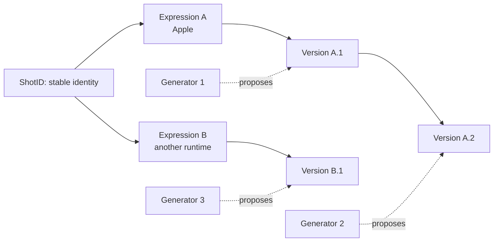
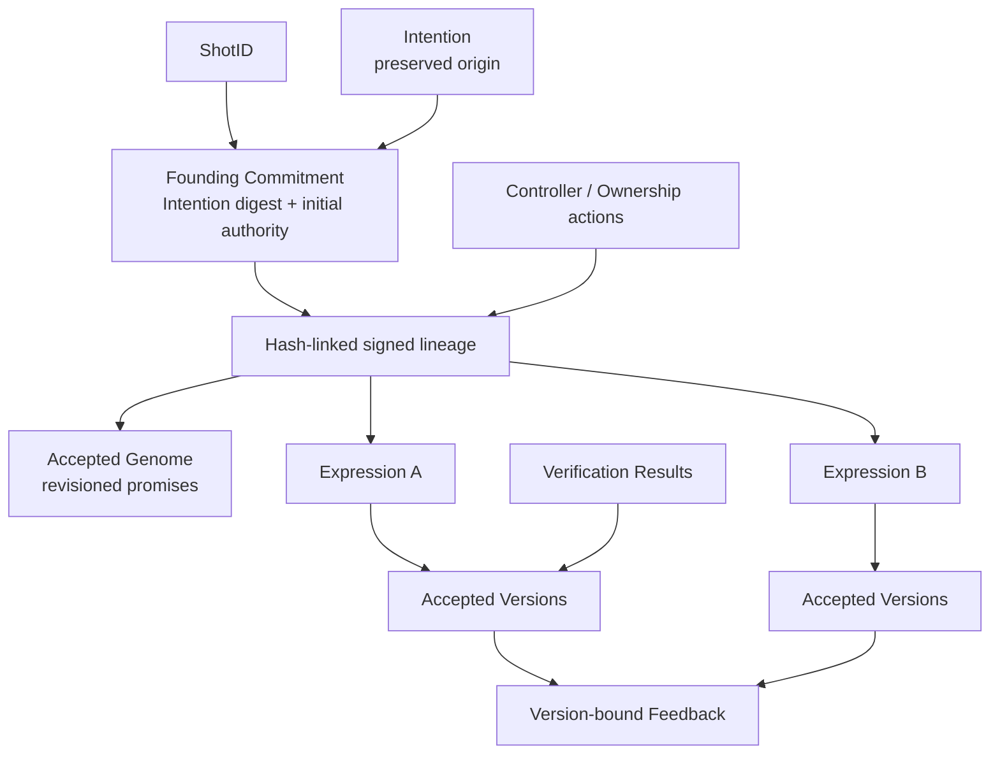
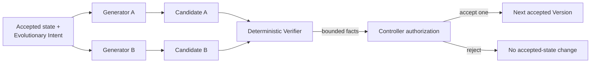
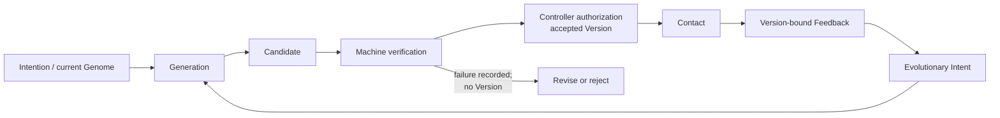

# TOHSENO: A Protocol for Software Continuity

## Persistent identity across changing implementations

**Author:** JP Franetovic  
**Affiliation:** Anky, Inc.  
**Date:** August 2026  
**Status:** Composite pre-1.0 protocol candidate; working paper

## Abstract

Software is usually identified by something that gives it a present form: a repository, package, binary, bundle identifier, account, deployment, model session, vendor, or running service. Those identifiers can name locations, providers, or exact artifacts. They do not by themselves define one continuing software object across materially different implementations.

TOHSENO proposes such an object: the **Shot**. A Shot has a random stable identifier and a controller-authorized history that binds a preserved founding **Intention**, an explicitly accepted and revisioned **Genome**, one or more runtime **Expressions**, immutable accepted **Versions**, and evidence about both machine verification and use. Continuity is not inferred from code similarity. It is an explicit protocol claim: the current controller authorizes a proposed state under declared constraints, and deterministic reduction makes the claim and its ancestry mechanically checkable. Cryptography establishes commitments, signatures, and ordering; it does not establish usefulness, semantic wisdom, or legal title.

A Shot begins locally. Private material need not be published. An optional public Witness may record a deliberately narrow projection without creating the Shot or acquiring control. Git, content-addressed storage, reproducible builds, and supply-chain attestations can serve as substrates and evidence; TOHSENO does not replace them. Its proposed contribution is the software-specific continuity state machine that composes them.

The first factory is Apple-oriented, but neither Apple nor its Generator is privileged by the protocol. If the Builder retains the necessary keys, records, source, assets, data, and build knowledge, another Generator can continue the Shot. The first Generator can disappear. The Shot remains.

## 1. Introduction: software without continuity

Software has acquired excellent identifiers for many things around it. Git names exact content and connects commits into histories. Package managers name releases. OCI descriptors address packaged artifacts. App stores bind listings to vendor accounts and bundle identifiers. Build systems describe derivations. Supply-chain attestations state how an artifact was produced. A running service can be named by an origin, account, or endpoint.

Each answer is useful, but each answers a narrower question than this one:

> What makes a materially changed implementation a later state of the same software object?

Ordinary practice answers socially. A maintainer says that a rewrite is version 2. A company moves a product between repositories. A mobile application is rebuilt for another platform. A hosted service changes every internal component while keeping its name and account. These continuities may be sensible, but the underlying systems usually identify the artifacts, locations, and authorities involved rather than encoding the continuity claim itself.

Generative systems make the gap easier to see. They can produce many plausible implementations from the same request, replace a source tree, or reconstruct an interface in another language. Artificial intelligence did not create the continuity problem; rewrites, ports, forks, maintainer transfers, and disappearing vendors long predate it. Generation makes implementation cheaper and more replaceable, so the absence of a durable object around which implementations change becomes more consequential. A prompt or agent session cannot carry that burden. It is provider-specific, often incomplete, and neither an accepted state nor an authority record.

TOHSENO tests a narrow hypothesis:

> A Shot is a continuing software object whose identity is independent of any particular implementation.

The claim is not that software possesses an essence, or that a protocol can discover metaphysical sameness. The claim is operational. A Shot is constituted by a stable identity and a typed, signed, reducible history with domain-specific rules for origin, accepted constraints, implementations, evidence, and authority. Independent conforming software can decide whether a sequence of records is a valid continuation of that object. It cannot decide whether the continuation was a good idea.

This separation is the center of the proposal. A radical rewrite may be admitted under the same Shot if the authorized controller accepts it through the required transitions. The controller may instead create a distinct Shot and declare a parent relationship. The protocol exposes which choice was made, who had authority to make it, what commitments changed, and what evidence preceded it. It does not turn judgment into a hash.

The result is neither a replacement for version control nor a universal identity layer. It is a candidate protocol object for software continuity.

## 2. Continuity through change

The Ship of Theseus, a changing organism, and a seed becoming a tree all supply the same useful intuition: material persistence and identity persistence are different questions. None supplies a protocol rule. A seed does not contain a pixel-perfect mature tree; a person is not identified by a checksum of one bodily state; a ship's name does not settle every dispute about replacement. These analogies reveal the problem and then stop.

TOHSENO replaces metaphor with explicit distinctions:

- The **Shot** is the continuing protocol object.
- The **Intention** preserves the exact founding material.
- The **Genome** records the currently accepted operational promises and boundaries.
- An **Expression** is one concrete body in a particular environment.
- A **Version** records one accepted state of one Expression.
- An **Evolution** is an authorized transition between adjacent accepted Versions.
- **Contact** is the encounter between an Expression and reality.
- **Evidence** records bounded machine findings or observations from Contact.
- A **Generator** proposes an implementation.
- A **Verifier** establishes declared machine facts.
- The current controller authorizes what enters accepted history.
- An optional **Witness** preserves a narrow public projection; it does not create identity.

The biological vocabulary is therefore mnemonic, not ontological. The Genome is not the Shot, and software is not literally alive. Continuity results from a stable identifier, preserved records, accepted constraints, content commitments, explicit transition rules, controller authorization, and visible lineage.

Figure 1 shows the core distinction. The ShotID does not change when source, runtime, or Generator changes. Expression and Version identifiers do change where the protocol requires them to.



*Figure 1 — The continuing Shot. One Shot may have changing accepted Versions and multiple Expressions. Generators produce candidates; they are not the identity.*

The stable identifier is useful only because the rest of the state machine gives references to it consequences. A random label with no verifiable genesis, transition law, or retained material would be ceremonial. TOHSENO's newness claim must therefore rest on the complete object, not on the label alone.

## 3. The proposed primitive

### 3.1 Definition

Within this candidate, a **Shot** is the continuing protocol object formed by:

1. a random, stable ShotID;
2. a signed founding commitment to exact Intention material and initial authority;
3. a current accepted Genome and its explicit revision history;
4. declared Expressions and their immutable accepted Versions;
5. evidence and evolutionary decisions bound to exact Versions; and
6. a controller-authorized, hash-linked lineage reducible under the protocol rules.

This definition identifies an event-sourced aggregate specialized for software. The current state is not stored as an unexamined mutable row. It is derived from a valid prefix of signed actions. Domain rules determine which actions may follow: an initial Genome must be proposed and accepted; an Expression must bind an accepted Genome; a Version requires a matching successful VerificationResult; feedback must name an accepted Version; an Ownership action must be authorized by the current controller; and so on.

The Shot is not identical to its name, alias, folder, repository, prompt, source tree, current body, binary, app-store listing, token, controller, Generator, public checkpoint, or any Version. Any of these may be changed, lost, duplicated, or replaced without changing the ShotID. Whether the Shot remains *materially continuable* is a separate question considered in Section 11.

### 3.2 What the ShotID proves

A native ShotID is a cryptographically random, nonzero 32-byte value created once. It is deliberately not derived from an Intention, source digest, BuilderID, token address, bundle identifier, name, or repository. Deriving it from mutable content would make continuity impossible; deriving it from a controller would make transfer change identity.

The ShotID alone proves almost nothing. It is a collision-resistant namespace value, not evidence of authorship, content, public registration, legal ownership, or quality. Its significance arises when a verifier is given a valid founding action and enough authorized lineage to reduce the Shot's state. A reference to a bare ShotID should therefore be read as a claim awaiting context.

For exact content, the protocol uses content commitments. For continuity, it uses the stable ShotID. Conflating those functions would either make changing software impossible or make exact-state verification vague.

### 3.3 A minimal transition model

The normative encodings are in the [protocol specification](protocol/SPECIFICATION.md), schemas, and conformance vectors. The following notation is explanatory.

Let a lineage action be:

```text
a_i = (schema, sequence i, previous h_(i-1), ShotID,
       actor, timestamp, availability, payload, H(payload))

h_i = SHA-256(RFC8785(a_i))
```

The action commitment `h_i` is also the digest signed once by its P-256 signature sidecar. Sequence one has no predecessor and carries a `Commitment` payload:

```text
Commitment(H(Intention), initial BuilderID,
           initial controller key, origin, time)
```

The full Intention record may be carried later, including privately, but its canonical digest must match the founding commitment. A deterministic reducer `R` accepts one complete prefix only if sequences and predecessor commitments are contiguous, timestamps do not move backward, the ShotID is constant, signatures are valid, each actor is the current authority, and each payload-specific transition is legal.

A VersionID is content-bound within a Shot and Expression:

```text
VersionID = SHA-256(
  "TOHSENO-VERSION-ID-V2\0" || ShotID || ExpressionID ||
  u64be(ordinal) || genome_digest || source_digest
)
```

The formula does not make two programs semantically equivalent. It makes an exact accepted state unambiguous relative to its Shot, Expression, ordinal, accepted Genome, and source commitment.

The lineage is a single-predecessor chain for any reducible branch. The broader history can contain competing children of one head, so the observed structure is a tree of incompatible prefixes rather than a mergeable Git DAG. The reducer does not erase competing heads or choose a global winner. A deliberately created descendant or fork is a different ShotID with an explicit `ParentRelation`; this is distinct from a same-Shot lineage conflict.

### 3.4 What persists

Across a valid continuation, the following persist:

- the ShotID;
- the founding commitment and, when available, exact Intention record;
- the append-only authorized lineage up to the selected head;
- every prior accepted Genome revision and Version commitment;
- the current controller state derived from authorized Ownership actions;
- explicit relationships among Expressions, Versions, evidence, and Evolutions.

Names, interfaces, frameworks, languages, source layouts, Generators, models, devices, accounts, repositories, package coordinates, and distribution channels may change. A Genome may change only by proposal and acceptance. An Expression may receive later Versions; another body requires another ExpressionID. An accepted Version never changes in place.

This is scoped continuity, not universal tracking. Installation identity is local to an application installation. Continuity statements have an explicit Shot audience and bounded claims. The protocol does not give every application a universal cross-service identity for a person.

## 4. Shot anatomy

Figure 2 shows the records that carry the object. Not every conceptual role is a distinct wire payload: Contact is an event in use; Lived Evidence is represented through version-bound Feedback; and Generator and Verifier are roles around proposal and testing. The canonical lineage payload types are defined by the neutral `/2` schema.



*Figure 2 — Shot anatomy. The Shot is the whole reducible object, not the Genome or any single body. Arrows show logical bindings rather than public disclosure.*

### 4.1 Intention

The **Intention** is the preserved human declaration from which the Shot began. In the neutral model it contains one to sixty-four original materials: words, images, references, examples, or other artifacts described by exact digests and availability. Inline text, when present, is bound to exact bytes and length. An optional note and capture time are part of the canonical record.

The Intention is historical evidence, not a perpetually edited product brief. Correcting its spelling after seeing the implementation would change its commitment and falsely rewrite origin. Later understanding belongs in Feedback, an Evolutionary Intention, or a Genome proposal. The full founding material may remain intentionally private while its digest remains bound at genesis.

Preservation does not establish that the Intention was original, lawful, wise, or written by the person named in prose. It establishes that the later Shot history refers to the same committed bytes.

### 4.2 Genome

The **Genome** is the accepted operational constitution of the Shot. It records a revision number and structured statements about purpose, intended users, essential experience, behavioral invariants, interaction laws, privacy and ownership principles, boundaries, non-goals, required capabilities, forbidden transformations, acceptance principles, platform commitments, and matters free to change.

It is more precise than “DNA.” The Genome is neither source code nor a complete architecture. It is not a Generator prompt, static configuration file, model memory, or test suite. Files, gates, and tests may represent and check portions of it, but they remain mechanisms serving the accepted law. Some provisions are mechanically testable; others require Builder judgment.

The distinction can be stated compactly:

> Intention preserves origin. Genome preserves promises.

A Genome becomes current only through two signed actions: a proposal and an explicit acceptance that references that proposal's action commitment. Revision one has no base. A later proposal must name the exact current revision and digest and summarize its mutations. A Version cannot smuggle in a Genome change by merely pointing at new prose.

The Genome does not make semantic conformance decidable. A malicious or careless controller can accept a weak Genome, revise away a defining promise, or approve an implementation that violates a nuanced requirement. The protocol makes those decisions attributable and reviewable; it cannot make them sound.

### 4.3 Expression

An **Expression** is one concrete body of the Shot in an environment. Its declaration has a random stable ExpressionID, a kind, a name, one or more platforms, the accepted Genome revision and digest it claims to embody, and a reference describing the availability of its definition artifact.

Two iOS implementations may be successive Versions of one Expression if the controller treats them as continuations of that body. A mobile application and a web or desktop application may instead be separate Expressions under one Shot. They share Shot identity and accepted law, not necessarily source, interface, storage format, or capabilities.

The protocol does not mechanically prove that multiple Expressions are “really” the same application. It proves that an authorized lineage declared them to be bodies of one Shot under specified Genome commitments. Reviewers can inspect the declaration and evidence; the controller bears the semantic judgment.

The neutral schema also includes **Organ** declarations: immutable, expression-scoped capability units whose dependency graph, state ownership, permissions, events, Genome constraints, and acceptance tests contribute to a Version's capability-graph digest. Organ is useful structured capability vocabulary. The current Apple Fascia gives it a concrete profile. It should not be mistaken for the Shot's timeless essence or assumed to map naturally to every future runtime.

### 4.4 Version

A **Version** is one immutable accepted state of one Expression. Its record binds:

- the ExpressionID and expression-local ordinal;
- the accepted Genome revision and digest;
- the source digest;
- materialization provenance;
- the exact capability-graph digest;
- a matching successful VerificationResult action;
- known incompleteness;
- acceptance time; and
- optional build identity and build digest.

“Immutable” here is a verification property, not a claim that storage media cannot be edited. Changing the canonical action changes its commitment, breaks successor links, or invalidates the signature. The old accepted state remains the state named by its VersionID. Later work creates another Version; it does not rewrite this one.

A working tree is not a Version. Neither is a model response, candidate source directory, Git commit, successful compilation, binary, deployment, or app-store release. Any may contribute evidence or a digest. A Version exists in accepted protocol history only after a successful matching VerificationResult and an authorized Version action.

Acceptance does not imply completeness or reproducibility. Known incompleteness is explicit, a build digest is optional, and material referenced by a digest may later be unavailable. Reproducing an artifact requires the stronger conditions of a reproducible build system and retention of all necessary inputs.

### 4.5 Evolution

An **Evolution** is an authorized transition between two distinct adjacent accepted Versions of the same Expression. It references an earlier Evolutionary Intent, names the exact from- and to-VersionIDs and Genome digests, states preserved invariants, and—when the Genome changed—references the exact Genome acceptance.

Not every source edit, Git commit, build, model generation, deployment, or accepted Version is by itself an Evolution. An Evolution closes a declared change from the previously current Version to the newly current one. The target Version must already be accepted; the reducer then checks adjacency and intent.

At protocol level this yields three different cases:

1. **Working change:** files differ, but no accepted action exists. The Shot's accepted state has not moved.
2. **Accepted successor:** required records, verification, Version acceptance, and Evolution form a valid continuation of the same Expression.
3. **New Shot:** a separate ShotID begins, optionally recording `fork`, `descendant`, or `inspired_by` relation to a parent head.

Copying a folder does not automatically create any of these claims. Possession of files is not controller authority.

### 4.6 Builder, controller, BuilderID, and DeviceKey

The **Builder** is the human or organization making creative and custodial decisions. The wire protocol cannot prove that a human personally considered each decision; it proves that an authorized key signed it. For this reason the paper uses **controller** for the mechanically evaluated authority state.

A **BuilderID** is the protocol identifier representing that authority. In the successor public design it has the form `eip155:4663:0x…` and denotes a BuilderAccount address on chain 4663. An address-shaped local or predicted identifier is not proof that the account exists or is publicly authoritative. Neutral lineage binds an initial BuilderID and P-256 controller public key; an Ownership action signed by the current controller installs the next BuilderID and controller key.

A **DeviceKey** is a P-256 key authorized within a BuilderAccount. The successor account design separates devices from administrators, allows delegation by permission, and provides delayed recovery that replaces the key set only after a three-day window in which an administrator can cancel. Recovery authority, device rotation, Builder control, and Apple code-signing identity are different concerns. Apple signing is external to TOHSENO's controller-key protocol.

The frozen v0.7 identity supports only its initial device key; rotation and recovery were never completed for that lineage. The successor on-chain design closes the contract semantics and is deployed and active on its target chain under a threshold-signed release authority; the public witness workflows that would write to it are still being built, so accepted state remains local.

### 4.7 Generator and Verifier

A **Generator** is any system that proposes implementation material or a transition: Codex, Claude Code, another coding harness, a human team, a specialized program synthesizer, or a deterministic toolchain. The first Generator has no permanent privilege.

A **Verifier** is a deterministic system that evaluates declared gates and records bounded results against a candidate. It may establish that canonical commitments match, signatures verify, source conforms to a profile rule, a permission is present or absent, specified tests pass, or a build succeeds. The VerificationResult binds the candidate VersionID, Genome, source, capability graph, gate conjunction, known incompleteness, and time.

A Verifier does not prove usefulness, beauty, absence of all defects, full semantic fidelity to natural language, or metaphysical sameness between Expressions. A gate also does not prove that the external test runner itself was trustworthy. Verifier policy and evidence remain reviewable assumptions.

The intended separation is:

> Generation produces a proposal. Verification establishes bounded machine facts. Authorization makes an accepted Version part of history.

The neutral wire schema requires a successful VerificationResult before a Version, but it does not cryptographically enforce organizational independence between Generator and Verifier. A single operator could run both, and the controller could authorize nonsense. Independence is therefore a system and profile requirement, not a fact implied by the record type alone.

## 5. Origin and law without revisionism

The Intention/Genome split solves a recurring provenance failure. If one document must serve both as the origin story and the current specification, evolution produces pressure to rewrite history. A later implementation discovers what the original words omitted; the document is “clarified”; the new system then appears to have satisfied an intention that did not exist at genesis.

TOHSENO instead treats origin and present law as separate timelines. The founding action commits to the Intention. The Intention action, whenever disclosed, must match that digest and may occur only once. The Genome begins at revision one and may change explicitly. Feedback can explain why. An Evolutionary Intent can select exact feedback actions and request implementation-, Expression-, Organ-, or Genome-scoped changes. A later Genome proposal names its exact base and mutation summary.

This does not make the founding words supreme. A vague, harmful, or obsolete Intention may deserve to be left behind. The controller can authorize a Genome that departs radically from it. What the protocol prevents is silent retroactive repair. A reviewer can see both what began the Shot and what it later promised.

That distinction also limits the founding record's power. Intention is evidence of origin, not a perpetual veto, source of legal rights, or oracle of meaning. Genome is current accepted law, not proof that reality conforms to it.

## 6. Bodies and accepted moments

Software continuity requires both stable identity and exact-state identity. A ShotID alone deliberately survives content changes; a VersionID deliberately does not. Expressions locate exact Versions within distinct bodies.

Suppose a field-notebook Shot first appears as a native iPhone app. Its Apple Expression has an ExpressionID and Version 1 binds the accepted Genome, source, capabilities, verification, and known limitations. A later rewrite in a different UI framework can be Version 2 of the same Expression if the authorized history treats it that way. A web implementation can be a second Expression with its own random ExpressionID and ordinal sequence. Both bodies can cite the same current Genome while having different source and platform commitments.

There is no requirement that all Expressions advance together. The iPhone body might be on Version 4 and the web body on Version 1. Feedback must name the exact ExpressionID and VersionID that produced it, so an observation about the web interface cannot silently become evidence about the mobile implementation.

The protocol's immutability is selective. Accepted moments and prior actions do not change. The current head, current Genome, controller, known availability, and collection of Expressions can change only by adding valid actions. This freezes history without freezing software.

An unavailable artifact demonstrates the limit of commitments. A digest can prove that rediscovered bytes are the committed bytes; it cannot reconstruct missing bytes. An `artifact_availability` action can later record an observation without rewriting the referenced record, but an availability label does not make material exist.

## 7. Generation, verification, and authorization

Agentic development often collapses three acts. A model writes code, runs tests that it selected, and reports completion. That report can be useful, but it combines proposal, measurement, and acceptance under one epistemic boundary.

TOHSENO separates them because their failure modes differ:

- A Generator can misunderstand the request, omit files, fabricate a success report, or optimize for a weak test.
- A Verifier can have incomplete gates, execute compromised tools, or correctly prove an irrelevant property.
- A controller can be careless, coerced, compromised, or simply choose badly.

The protocol does not eliminate any failure. It makes the roles and resulting claims distinct. A failed VerificationResult may remain in honest history, but it cannot authorize a Version. A passed result must match the candidate's source digest, Genome, capability graph, VersionID, and known incompleteness. The current controller then signs the Version action. The signature establishes key authorization, not conscious human review.

This design permits a Generator to be replaced without replacing Shot identity. A new system receives the retained Intention, current Genome, selected evidence, exact accepted state, and a scoped evolutionary request. It proposes source. A compatible Verifier evaluates the proposal. The controller rejects it or authorizes it. No model session needs to become canonical memory.



*Figure 3 — Replaceable Generators. Multiple systems may propose candidates for one Shot. Verification and controller authorization determine whether any candidate becomes an accepted Version.*

The figure describes protocol possibility, not a claim that the present factory has demonstrated every Generator or runtime. Interoperability requires other implementations to reproduce canonicalization, signatures, reduction, profile rules, and materialization semantics. Until they do, replaceability is designed and testable at record boundaries but only partly evidenced in operation.

## 8. Contact, evidence, and evolution

A build passing is not the same as an application working in life. TOHSENO calls the encounter between a particular Expression Version and its environment **Contact**. Contact is not a magical validation stage and is not currently a standalone lineage payload. It names the point at which the software meets a person, device, routine, and circumstance that a machine gate cannot fully model.

Two classes of evidence must remain distinct.

**Machine Evidence** consists of bounded technical findings: a digest matched, a signature verified, a schema and semantic reducer accepted a record, a test passed, a build completed, a source scanner found or rejected a declared capability, or an artifact matched an expected commitment. Its force is conditional on the gate, tool, inputs, and environment.

**Lived Evidence** records what Contact revealed: a gesture felt natural or false; a routine survived a week or failed on the first day; a person misunderstood the central behavior; the supposedly secondary feature contained the actual value; the Shot should become smaller; or the accepted Genome should change. The neutral protocol represents this through `Feedback`, which must name an exact accepted Expression and Version and may include text, structured observations, attachments, author information, and an optional matching build identity.

Feelings must not impersonate cryptographic proof. A signed note that an interface was confusing proves the integrity and attribution of that note within the relevant authority context; it does not prove universal confusion. Conversely, a green test suite must not impersonate usefulness.

Figure 4 shows the lifecycle. Authorization is shown after verification for Version acceptance. In the exact reducer, a Genome change requires its own proposal and acceptance, the target Version is recorded after matching verification, and the Evolution action then connects the old and new accepted Versions.



*Figure 4 — The evolutionary loop. Machine Evidence and Lived Evidence answer different questions. Both refer to exact candidate or accepted state.*

### 8.1 A field-notebook Shot

Consider Maya, who wants a small private field notebook for observations made on walks.

1. Maya records an Intention in plain words and includes two sketches. The system commits their exact bytes and creates a random ShotID. The materials can remain local.
2. A Generator proposes Genome revision 1: the notebook is for one person's field observations; capture must be quick; data remains on device; there are no accounts or analytics; observations can be corrected without erasing earlier accepted history. Maya accepts that proposal.
3. The Apple factory declares an iPhone Expression and its capability graph. A coding harness proposes the first source tree.
4. Deterministic gates check bounded facts: source and Genome commitments agree, forbidden capabilities are absent, required profile structure exists, tests pass, and the app builds in the supported environment. These checks do not show that capture feels quick.
5. Maya's controller authorizes Version 1. Its record binds the source, Genome, capability graph, VerificationResult, provenance, and known incompleteness.
6. Maya uses that exact Version on walks. She finds that the three-step capture flow makes short observations disappear from practice.
7. She records private Feedback against the exact iPhone Expression and Version 1. The note is not generalized to later versions.
8. She authorizes an Evolutionary Intent selecting that signed Feedback action and asking for one-step capture while preserving local-only storage and the rest of the Genome.
9. A different compatible Generator receives the scoped materials and proposes candidate source for Version 2. This is a protocol-level possibility; the current repository does not claim a completed cross-vendor interoperability trial.
10. Verification checks the declared gates. Maya may reject the candidate with no accepted-state change, or authorize Version 2 and the Evolution from Version 1.
11. Years later, a desktop Generator may declare a new Expression under the same Shot and current Genome. It receives its own ExpressionID and Version sequence rather than pretending to be the iPhone body.
12. The original Generator and model session are gone. If Maya still possesses the authoritative records, controller capability, necessary source and assets, local data, build instructions, and compatible tooling, the Shot can continue.

The protocol proves the record relationships in this story. It does not prove that Maya's revised interface is better, that the desktop body deserves the same identity, or that every necessary artifact was retained. Those remain judgment and custody questions.

